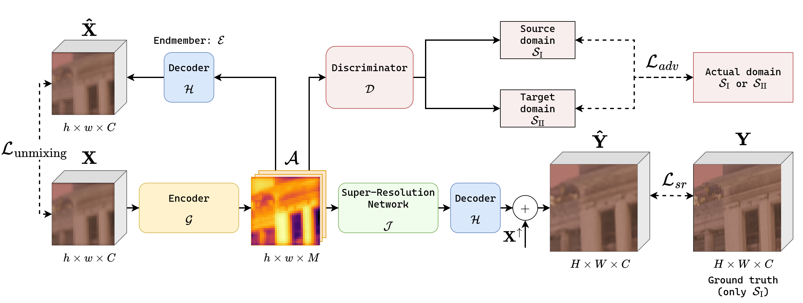
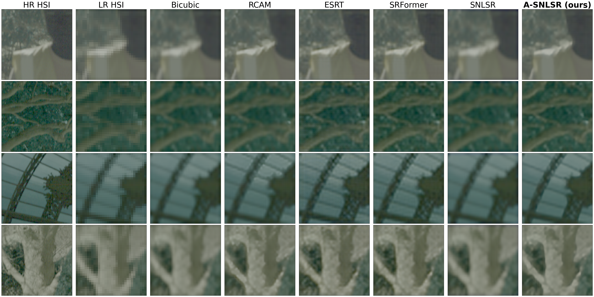

# A-SNLSR
Official implementation of the paper: <b>Cross-Spectral Domain Adpatation for Hyperspectral Image Super-Resolution</b>.

<b>Abstract:</b>
Deep learning methods have seen great success for super-resolution tasks over a variety of domains. However, for super-resolution in hyperspectral imaging (HSI) one of the bottlenecks for performance is the availability of high-quality training data sets with high spatial resolution. This issue is further exacerbated in the case of HSI spectral domains for which accessible data is even more scarce, such as those in the infrared range. To address this problem, we propose a novel unsupervised adversarial domain adaptation method that allows the transfer of knowledge from a model trained on hyperspectral images from a range of the electromagnetic spectrum with high-resolution training data to a target spectral range where ground truth high-resolution data is unavailable. We illustrate the performance of our method on a novel hyperspectral data set in the short-wave infrared (SWIR) spectrum. When applying our domain adaptation method, a performance increase can be observed, compared to standard super-resolution methods, in the target domain.

Paper access: [to be added when published].

<b>Network architecture:</b>

<b>Illustration of domain alignment obtained with adversarial learning:</b>

## Dataset

Data access: [<b><u>NextCloud</u></b>](https://nextcloud.rma.ac.be/index.php/s/DtbtLjTqcFpETWB)

### Dataset specifications

Our dataset includes 6 outdoors, naturally-lit scenes in the <i>Short Wave Infrared</i> (SWIR) spectrum with wavelengths between 1000nm and 2500nm. Each image has 300 bands with consistent steps in the spectrum, the resolution is $5809 \times 620$. Images were captured using the [Mjolnir-S620 camera](https://www.hyspex.com/hyspex-products/hyspex-mjolnir/mjolnir-s-620).

Four scenes include objects of a city park, and two mainly include buildings. Scenes were captured around 12am with a clear sky in order to have enough luminosity. 

### Dataset folders

There are three folders in the dataset:

* `processed_tiles` Includes two subfolders: `swir_park_dom1_x4` for the SWIR1 spectrum (1000nm - 1700nm) and `swir_park_dom2_x4` for the SWIR2 spectrum (1700nm - 2500nm). You should place respectively in the `./data/swir_park_dom1_x4` and `./data_swir_park_dom2_x4` folders.

* `radiance` contains the 6 non-processed SWIR radiance scenes as ENVI files. They can be transformed into tiles with the `./scripts/0_prepare_tiles.py` script.

* `train_val_splits` contains multiple split folders. Split folders contain the tile names which should be part of the training or the validation splits. Note that splits vary accross domains:

    - `swir1_sisr_swir2_val.npz` Has 33.3% of the dataset as validation in SWIR2, and 33.3% of the dataset as training in SWIR1.
    - `swir1_swir2_adversarial_swir2_val.npz` the same as `swir1_sisr_swir2_val.npz`, but also contains SWIR1 in validation (using the same tiles) and an additional 33.3% of the tiles in the training set as SWIR2. 

## Results
The results of bicubic interpolation, RCAM, ESRT, SRFormer, SNLSR and our proposed solution (A-SNLSR) for $\times4$ HSI super-resolution. For the stochastic models, the performance shown is the average with standard deviation over 10 different runs. The proposed A-SNLSR method offers a clear performance increase.

| Model | PSNR (↑) | SSIM (↑) | ERGAS (↓) | SAM (↓) | RMSE (↓) | Time (m) |
| - | - | - | - | - | - | - |
| Bicubic [18] | 31.89 | 0.78 | **0.643** | 5.099 | 0.026 | - |
| RCAM [23]| 33.20 (±0.13) | 0.78 (±0.024) | 0.821 (±0.04) | 5.271 (±0.309) | 0.022 (±0.0003) | 7.41 (±2.13) |
| ESRT [9] | 33.43 (±0.23) | 0.78 (±0.023) | 0.802 (±0.01) | 5.615 (±0.344) | 0.021 (±0.0005) | 12.84 (±3.02) |
| SRFormer [10] | 33.33 (±0.54) | 0.79 (±0.022) | 0.791 (±0.02) | 5.328 (±0.401) | 0.022 (±0.001) | 11.96 (±1.09) |
| SNLSR [16] | 31.99 (±0.033) | 0.78 (±0.0003) | 0.915 (±0.03) | 5.213 (±0.011) | 0.025 (±0.00) | 16.11 (±1.32) |
| A-SNLSR (Ours) | **33.82 (±0.14)** | **0.81 (±0.0007)** | 0.776 (±0.02) | **4.755 (±0.0223)** | **0.020 (±0.0003)** | 20.35 (±0.17) |

<b>A few examples from our dataset</b>:

## References

1. Yuan Yuan, Xiangtao Zheng, and Xiaoqiang Lu, “Hyperspectral image super-resolution by transfer learning,” *IEEE Journal of Selected Topics in Applied Earth Observations and Remote Sensing*, vol. 10, no. 5, pp. 1963–1974, 2017.

2. Xiaoyan Li, Lefei Zhang, and Jane You, “Domain transfer learning for hyperspectral image super-resolution,” *Remote Sensing*, vol. 11, no. 6, 2019.

3. Wilhelm Burger and Mark J. Burge, *Principles of Digital Image Processing: Core Algorithms*, Springer, 2009.

4. Chao Dong, Chen Change Loy, Kaiming He, and Xiaoou Tang, “Image super-resolution using deep convolutional networks,” *IEEE Transactions on Pattern Analysis and Machine Intelligence*, vol. 38, no. 2, pp. 295–307, 2015.

5. Ian J. Goodfellow, Jean Pouget-Abadie, Mehdi Mirza, Bing Xu, David Warde-Farley, Sherjil Ozair, Aaron Courville, and Yoshua Bengio, “Generative adversarial networks,” 2014.

6. Christian Ledig, Lucas Theis, Ferenc Huszár, Jose Caballero, Andrew Cunningham, Alejandro Acosta, Andrew Aitken, Alykhan Tejani, Johannes Totz, Zehan Wang, et al., “Photo-realistic single image super-resolution using a generative adversarial network,” in *Proceedings of the IEEE Conference on Computer Vision and Pattern Recognition*, 2017, pp. 4681–4690.

7. Xintao Wang, Ke Yu, Shixiang Wu, Jinjin Gu, Yihao Liu, Chao Dong, Yu Qiao, and Chen Change Loy, “ESRGAN: Enhanced super-resolution generative adversarial networks,” in *Proceedings of the European Conference on Computer Vision (ECCV) Workshops*, 2018, pp. 0–0.

8. Xintao Wang, Liangbin Xie, Chao Dong, and Ying Shan, “Real-ESRGAN: Training real-world blind super-resolution with pure synthetic data,” in *Proceedings of the IEEE/CVF International Conference on Computer Vision*, 2021, pp. 1905–1914.

9. Zhisheng Lu, Juncheng Li, Hong Liu, Chaoyan Huang, Linlin Zhang, and Tieyong Zeng, “Transformer for single image super-resolution,” in *2022 IEEE/CVF Conference on Computer Vision and Pattern Recognition Workshops (CVPRW)*, 2022, pp. 456–465.

10. Yupeng Zhou, Zhen Li, Chun-Le Guo, Song Bai, Ming-Ming Cheng, and Qibin Hou, “SRFormer: Permuted self-attention for single image super-resolution,” in *Proceedings of the IEEE/CVF International Conference on Computer Vision*, 2023, pp. 12780–12791.

11. Junjun Jiang, He Sun, Xianming Liu, and Jiayi Ma, “Learning spatial-spectral prior for super-resolution of hyperspectral imagery,” *IEEE Transactions on Computational Imaging*, vol. 6, pp. 1082–1096, 2020.

12. Jin-Fan Hu, Ting-Zhu Huang, Liang-Jian Deng, Tai-Xiang Jiang, Gemine Vivone, and Jocelyn Chanussot, “Hyperspectral image super-resolution via deep spatiospectral attention convolutional neural networks,” *IEEE Transactions on Neural Networks and Learning Systems*, vol. 33, no. 12, pp. 7251–7265, 2022.

13. Mingjin Zhang, Chi Zhang, Qiming Zhang, Jie Guo, Xinbo Gao, and Jing Zhang, “ESSAFormer: Efficient transformer for hyperspectral image super-resolution,” in *Proceedings of the IEEE/CVF International Conference on Computer Vision (ICCV)*, October 2023, pp. 23073–23084.

14. Lei Zhang, Jiangtao Nie, Wei Wei, Yanning Zhang, Shengcai Liao, and Ling Shao, “Unsupervised adaptation learning for hyperspectral imagery super-resolution,” in *Proceedings of the IEEE/CVF Conference on Computer Vision and Pattern Recognition (CVPR)*, June 2020.

15. Zhi-Zhu Ge, Zhao Ding, Yang Wang, Li-Feng Bian, and Chen Yang, “Spectral domain strategies for hyperspectral super-resolution: Transfer learning and channel enhance network,” *International Journal of Applied Earth Observation and Geoinformation*, vol. 134, pp. 104180, 2024.

16. Qian Hu, Xinya Wang, Junjun Jiang, Xiao-Ping Zhang, and Jiayi Ma, “Exploring the spectral prior for hyperspectral image super-resolution,” *IEEE Transactions on Image Processing*, vol. 33, pp. 5260–5272, 2024.

17. Roberta Yuhas, Alexander Goetz, and Joe Boardman, “Discrimination among semi-arid landscape endmembers using the spectral angle mapper (SAM) algorithm,” in *JPL, Summaries of the Third Annual JPL Airborne Geoscience Workshop. Volume 1: AVIRIS Workshop*, 1992.

18. Robert Keys, “Cubic convolution interpolation for digital image processing,” *IEEE Transactions on Acoustics, Speech, and Signal Processing*, vol. 29, no. 6, pp. 1153–1160, 2003.

19. Yaroslav Ganin and Victor Lempitsky, “Unsupervised domain adaptation by backpropagation,” in *International Conference on Machine Learning*. PMLR, 2015, pp. 1180–1189.

20. “A-SNLSR code,” 2025, <https://github.com/RMA-4DPL/A-SNLSR> [Accessed: 2025-07-07].

21. HySpex, “Mjolnir S-620,” 2025, <https://www.hyspex.com/hyspex-products/hyspex-mjolnir/hyspex-mjolnir-s-620/> [Accessed: 2025-07-03].

22. Ossila, “The solar spectrum,” 2025, <https://www.ossila.com/pages/the-solar-spectrum> [Accessed: 2025-07-07].

23. Tao Zhang, Ying Fu, Liwei Huang, Siyuan Li, Shaodi You, and Chenggang Yan, “RGB-guided hyperspectral image super-resolution with deep progressive learning,” *CAAI Transactions on Intelligence Technology*, vol. 9, no. 3, pp. 679–694, July 2023.
